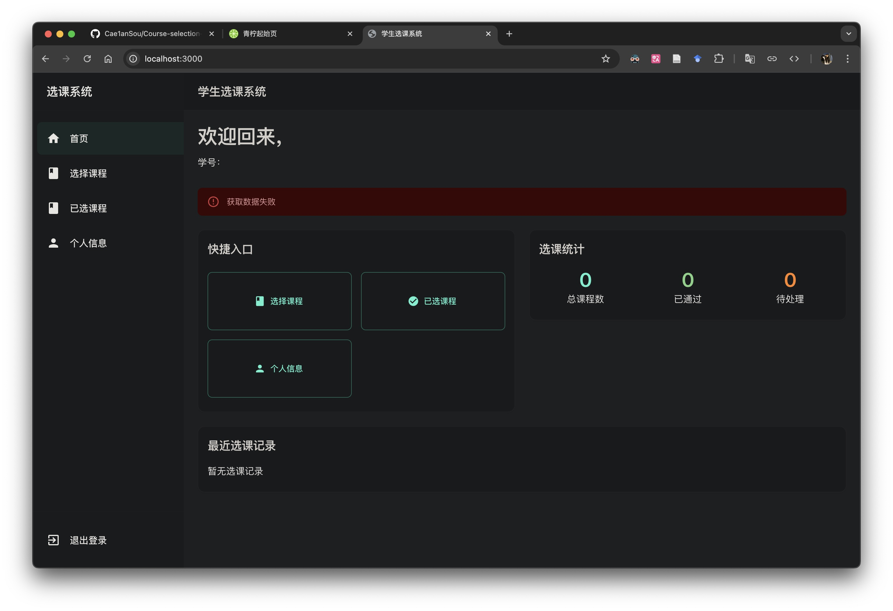
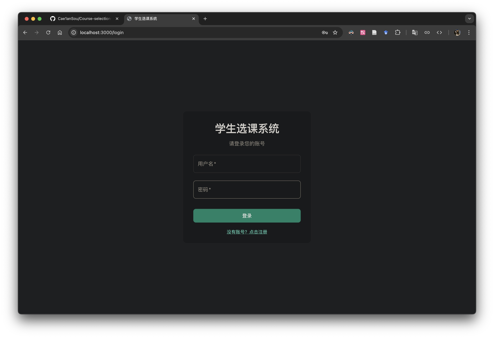

# 智能课程补选助手

## 📝 项目简介

在大学生活中，选课往往是一个令人头疼的问题。每到选课季节，学生们都要面对复杂的课程安排和时间冲突。特别是在补选阶段，由于已经有了固定的课表，想要额外选修课程变得更加困难。学生们需要在众多可选课程中，反复比对时间，手动计算是否与已有课程存在冲突，这个过程不仅耗时，还容易出错。

更具挑战性的是会因为与已有课程时间冲突而不得不放弃。但实际上，通过调整已有课程的时间段（比如更换到相同课程的其他时间段），可能存在一个两全其美的解决方案。然而，手动寻找这样的方案需要考虑太多因素：是否是必修课？教师是否相同？学分是否匹配？这些都让补选过程变得异常复杂。

为了解决这个困扰，开发了这个智能课程补选助手。它能自动读取学生的已有课表，并根据学生的补选意愿，智能计算出最优的课程组合方案。系统不仅考虑了时间冲突的问题，还能在必要时提供灵活的调课建议，确保学生能够选到最多想要的课程。

这个系统的目标很简单：让每个学生都能轻松地完成课程补选，不再为复杂的时间安排而烦恼，把宝贵的时间用在更有意义的学习上。通过智能化的排课算法和友好的操作界面，希望能让选课变成一件轻松愉快的事情。

### 主要功能
- 📊 支持导入个人已有课表（PDF格式）
- 📑 支持导入全校课程数据（CSV格式）
- 🔍 智能检测课程时间冲突
- 💡 提供最大化选课方案推荐
- 🔄 必要时提供调课建议
- 📱 支持电脑和手机访问

### 使用的技术
- **后端**：Django + Django REST framework + pdfplumber + pandas
- **前端**：React (TypeScript) + Material-UI
- **数据库**：SQLite

## 目录结构

```
├── README.md                 // 项目说明文件，包含项目规划、结构、环境搭建和协作指南
├── requirements.txt          // 后端 Python 依赖配置文件
├── 项目规划.md               // 项目详细规划文件，包含技术选型、模块设计、开发步骤等
├── docs                      // 项目其他文档（如用户手册、开发文档等）
├── backend                   // 后端代码目录
│   ├── manage.py             // Django 管理入口文件
│   ├── config                // Django 配置文件夹
│   │   ├── __init__.py
│   │   ├── settings.py
│   │   ├── urls.py
│   │   └── wsgi.py
│   └── apps                  // Django 应用模块目录
│       ├── users             // 用户模块（注册、登录、JWT 认证）
│       └── courses           // 课程模块（课程管理、文件解析、冲突检测等）
└── frontend                  // 前端代码目录
    ├── package.json          // 前端依赖配置文件
    ├── public                // 静态资源文件夹
    └── src                   // 前端源码目录
        ├── index.tsx        // React 入口文件
        ├── App.tsx          // 主应用组件
        ├── components       // 公共组件（按钮、卡片等）
        ├── pages            // 页面组件（登录页、选课页等）
        └── services         // 前后端 API 请求服务
```

## 环境搭建

### 后端（Django）
1. 安装 Python 3，并创建虚拟环境。
2. 安装依赖：在项目根目录执行 `pip install -r requirements.txt`。
3. 配置 Django 项目的 `settings.py` ，根据开发或生产环境调整配置。
4. 运行后端：在 `backend` 目录下执行 `python manage.py runserver`。

### 前端（React）
1. 安装 Node.js，并使用 npm 或 yarn 安装依赖：`npm install` 或 `yarn install`。
2. 配置前端项目（如 API 地址、端口号等）。
3. 运行前端：执行 `npm start` 或 `yarn start`。

## 开发规划

详细的项目规划请参阅 [项目规划.md](./项目规划.md)，其中包含：
- 技术选型与总体架构
- 模块设计（用户认证、文件上传与解析、课程数据管理、冲突检测等）
- 开发步骤与里程碑
- 部署与后续维护计划

## 协作指南

1. 请遵循 Git 分支管理规范：每个新功能模块使用独立分支，完成后合并至主分支前进行代码审查。
2. 保持代码注释清晰，每个模块和函数均应具备必要的文档说明。
3. 协作期间遇到问题请及时沟通，确保项目进度与质量。
4. 定期更新文档（包括 README.md 和项目规划文件），以便所有成员了解最新进展。

## 常用命令

### 后端
- 启动开发服务器：`python manage.py runserver`

### 前端
- 启动开发服务器：`npm start` 或 `yarn start`

